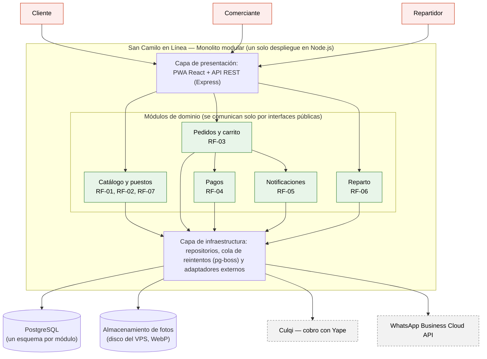
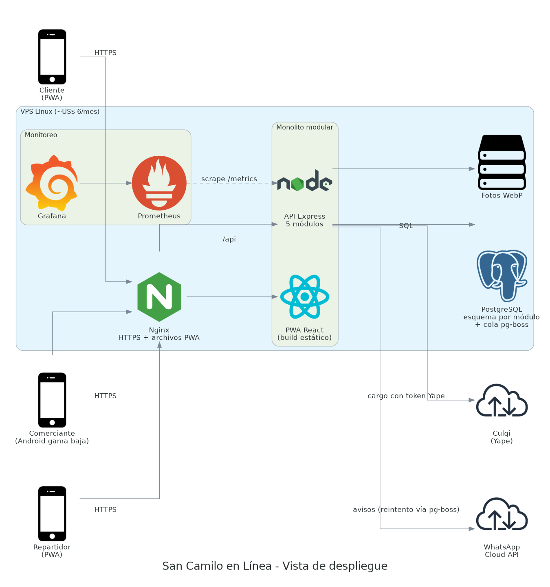

# San Camilo en Línea — Laboratorio 04: Fundamentos de arquitectura de software
Construcción de Software · EPIS-UNSA · 2026-B · Trabajo individual

## Integrantes
| Nombre | Rol en el laboratorio |
|--------|-----------------------|
| Gustavo Alonso Yunque Quispe (CUI 20220597) | Arquitecto, diagramador, redactor de ADR y verificador de IA |

## Caso
**N.º 7 — San Camilo en Línea.** Plataforma para hacer pedidos a los puestos del Mercado San Camilo de Arequipa, con recojo o delivery. Los comerciantes publican sus productos desde el celular, los clientes arman un solo pedido con productos de varios puestos y pagan con Yape, el comerciante recibe la confirmación por WhatsApp y un repartidor recoge y entrega.
**Atributo de calidad crítico — capacidad de interacción:** un comerciante con poca experiencia digital publica un producto en ≤ 3 toques desde un celular de gama baja ([QA-01](docs/architecture/drivers.md)).

**Stack propuesto:** PWA en React (Vite) · API Node.js/Express · PostgreSQL + pg-boss · Nginx en un VPS · Culqi (Yape) · WhatsApp Business Cloud API · Prometheus + Grafana.

## Arquitectura elegida: monolito modular (4,20 en la matriz)




## Entregables
| Código | Archivo |
|--------|---------|
| E1 | [drivers.md](docs/architecture/drivers.md) |
| E2 | [matriz-decision.md](docs/architecture/matriz-decision.md) |
| E3 | [diagramas/arquitectura.mmd](docs/architecture/diagramas/arquitectura.mmd) |
| E4 | [adr/](docs/architecture/adr/) |
| E5 | [diagramas/alternativa.puml](docs/architecture/diagramas/alternativa.puml) |
| E6 | [diagramas/despliegue.py](docs/architecture/diagramas/despliegue.py) |
| E7 | [bitacora-ia.md](docs/architecture/bitacora-ia.md) |
| Reto | [.github/workflows/mermaid.yml](.github/workflows/mermaid.yml) — regenera los PNG de Mermaid en cada push |

## Decisiones arquitectónicas
- [ADR-001: Monolito modular](docs/architecture/adr/001-estilo-arquitectonico.md)
- [ADR-002: PWA en lugar de app nativa](docs/architecture/adr/002-pwa-vs-app-nativa.md)
- [ADR-003: Pagos y notificaciones con adaptadores y cola de reintentos](docs/architecture/adr/003-pagos-y-notificaciones.md)

## Cómo regenerar los diagramas
```bash
cd docs/architecture/diagramas
npx -p @mermaid-js/mermaid-cli mmdc -i arquitectura.mmd -o img/arquitectura.png   # E3
java -jar plantuml.jar -tpng -o img alternativa.puml                             # E5
pip install diagrams matplotlib && python despliegue.py && python matriz.py      # E6 y gráfico de la matriz
```

## Reflexión sobre el uso de la IA
La IA (Claude) aceleró mucho el trabajo: propuso alternativas razonables, escribió el código de los tres diagramas y redactó borradores de ADR en minutos. Pero no fue una autoridad: cometió un error aritmético en la matriz (4,00 en lugar de 4,05) que solo se detectó al recalcular con un script, y propuso Redis como cola sin considerar que agrega un servicio más para una sola persona. La crítica adversarial fue lo más útil, porque obligó a la misma IA a buscar los puntos débiles de su recomendación. También aprendimos a verificar en la documentación oficial las afirmaciones sobre servicios externos, como el cobro con Yape a través de Culqi. La regla "la IA propone, el equipo decide y verifica" se cumplió en cada entrada de la bitácora.
