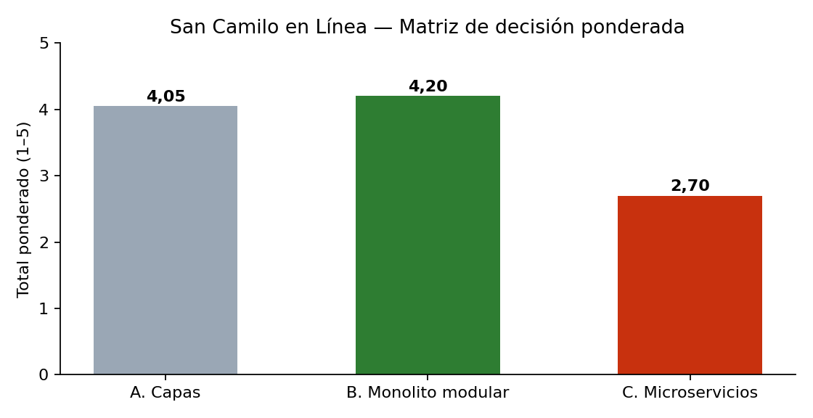

# Matriz de decisión — San Camilo en Línea

## Alternativas
- **A. Monolito en capas:** una sola aplicación Node.js/Express organizada en capas técnicas (rutas → controladores → servicios → repositorios) y una base de datos PostgreSQL. Todo se despliega junto en un VPS.
- **B. Monolito modular:** un solo despliegue, pero dividido por dominio en módulos (Catálogo, Pedidos, Pagos, Notificaciones, Reparto) con interfaces públicas; cada módulo tiene su propio esquema en PostgreSQL y las integraciones externas van por adaptadores.
- **C. Microservicios:** un servicio independiente por dominio, cada uno con su base de datos, detrás de un API Gateway y comunicados por un broker de eventos (RabbitMQ).

## Criterios y pesos (deben sumar 100 %)
| Criterio                            | Peso  | Justificación (driver relacionado)                                              |
|-------------------------------------|-------|---------------------------------------------------------------------------------|
| Tiempo de entrega                   | 25 %  | R-01: el MVP debe estar en producción en 1 mes, con 1 solo developer (R-02)     |
| Costo operativo                     | 20 %  | R-03: presupuesto bajo, un VPS de ~US$ 6/mes                                    |
| Capacidad de interacción (crítico)  | 20 %  | QA-01: publicar en ≤ 3 toques desde un celular de gama baja (R-06)              |
| Modificabilidad                     | 15 %  | Atributo 4: agregar Plin, otros mercados y cupones sin romper lo existente      |
| Simplicidad operativa               | 10 %  | R-02: una sola persona despliega, monitorea y corrige                           |
| Disponibilidad ante fallas externas | 10 %  | QA-02: 0 pedidos perdidos si falla WhatsApp                                     |
| **Total**                           | **100 %** |                                                                             |

## Puntajes (1 = muy malo, 5 = muy bueno)
| Criterio (peso)                         | A. Capas | B. Monolito modular | C. Microservicios |
|-----------------------------------------|:--------:|:-------------------:|:-----------------:|
| Tiempo de entrega (25 %)                | 5        | 4                   | 1                 |
| Costo operativo (20 %)                  | 5        | 5                   | 2                 |
| Capacidad de interacción (20 %)         | 4        | 4                   | 4                 |
| Modificabilidad (15 %)                  | 2        | 4                   | 5                 |
| Simplicidad operativa (10 %)            | 5        | 4                   | 1                 |
| Disponibilidad ante fallas ext. (10 %)  | 2        | 4                   | 4                 |
| **Total ponderado**                     | **4,05** | **4,20**            | **2,70**          |

> La capacidad de interacción depende sobre todo del frontend (PWA liviana, compresión de fotos en el celular), por eso las tres alternativas reciben el mismo puntaje en ese criterio.

## Afirmaciones de la IA corregidas o rechazadas
1. **Error de cálculo en la matriz** — corregida. En el primer borrador la IA reportó 4,00 para la alternativa A; al recalcular con el script `diagramas/matriz.py` el total correcto es **4,05** (1,25 + 1,00 + 0,80 + 0,30 + 0,50 + 0,20). El orden de las alternativas no cambió, pero se confirmó que ningún número se copia de la IA sin recalcularlo.
2. **Redis + BullMQ para la cola de reintentos** — corregida. La IA propuso Redis como componente adicional; en la crítica adversarial (bitácora, entrada 2) se observó que es un servicio más que una sola persona debe operar (R-02, R-03). Se reemplazó por **pg-boss**, una cola de trabajos que usa la misma base PostgreSQL.
3. **Pago con Yape** — verificada. Se confirmó en la documentación oficial de Culqi que el cobro con Yape para un comercio en línea se realiza con un token de Yape a través de la pasarela ([docs.culqi.com](https://docs.culqi.com/es/documentacion/pagos-online/cargo-unico/tokens-yape)), por eso R-05 exige una pasarela autorizada.

## Conclusión
Gana el **monolito modular (4,20)**. Es casi tan rápido de construir como el monolito en capas, cuesta lo mismo, y a cambio separa los dominios (Pagos, Notificaciones) para cambiarlos o aislar sus fallas. La decisión está registrada en [ADR-001](adr/001-estilo-arquitectonico.md).
