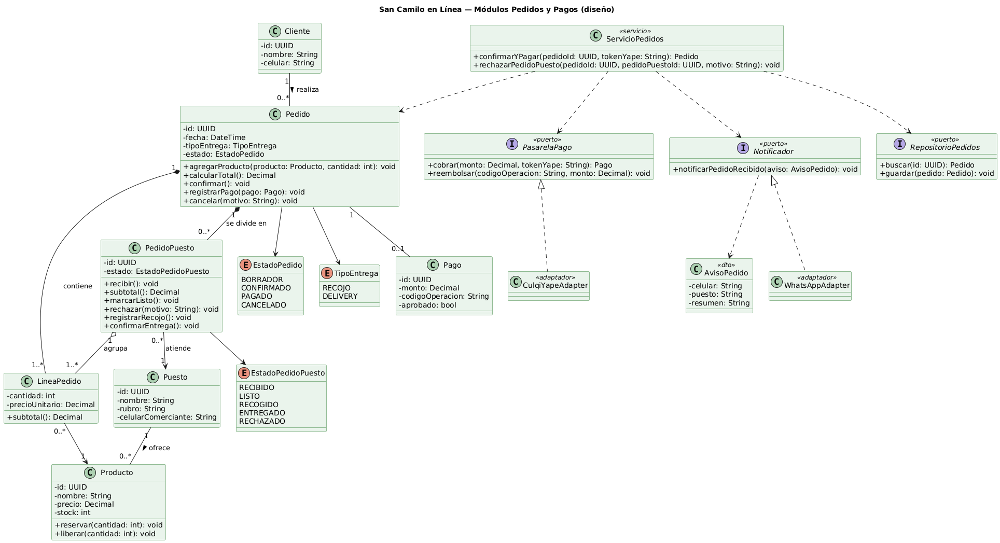
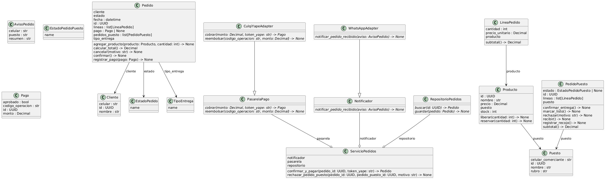

# Round-trip: del diagrama al código y de vuelta — San Camilo en Línea

## Ingeniería directa

A partir de `clases.puml` se generó con IA el esqueleto en Python 3.10 del módulo Pedidos, en `src/pedidos/dominio.py`: dataclasses con type hints, las tres enumeraciones, los puertos como clases abstractas y los adaptadores lanzando `NotImplementedError`.

Antes de aceptarlo se probó con adaptadores falsos un pedido de dos puestos: con pago aprobado quedan dos `PedidoPuesto` en RECIBIDO y dos avisos; con pago rechazado el pedido queda CANCELADO, sin sub-pedidos y con el stock devuelto.

## Ingeniería inversa

```bash
pip install pylint
pyreverse -o puml -p pedidos src/pedidos
java -jar plantuml.jar -tpng classes_pedidos.puml
```

El resultado está en `classes_pedidos_pyreverse.puml` y su imagen en `img/classes_pedidos.png`.

| Diagrama de diseño | Diagrama obtenido del código |
|---|---|
|  |  |

## Diferencias entre el diseño y el código

| N.º | Diferencia observada | Causa | Acción |
|---|---|---|---|
| 1 | No aparecen las composiciones Pedido–LineaPedido y Pedido–PedidoPuesto ni la agregación PedidoPuesto–LineaPedido; figuran como atributos `list[...]`. | pyreverse no infiere asociaciones a partir de colecciones tipadas. | Ninguna: es una limitación de la herramienta y el diagrama de diseño se mantiene. |
| 2 | No hay multiplicidades. | El código no las expresa. | Se corrigió el código: `confirmar()` valida que el pedido tenga al menos una línea, que es el 1..* del diseño. |
| 3 | `rechazar_pedido_puesto` recibe `pedido_id` además de `pedido_puesto_id`; en el diseño solo recibía el id del sub-pedido. | El puerto `RepositorioPedidos` solo busca pedidos, así que el servicio necesita el id del pedido para llegar al sub-pedido. | Se corrigió el diagrama: se agregó el parámetro `pedidoId` a `rechazarPedidoPuesto`. |
| 4 | `PasarelaPago`, `Notificador` y `RepositorioPedidos` aparecen como clases y no como interfaces, y los métodos de los adaptadores figuran como abstractos. | Python implementa las interfaces con ABC y los adaptadores aún lanzan `NotImplementedError`. | Aceptable en Python; se documenta. |
| 5 | `ServicioPedidos` aparece con una agregación hacia los tres puertos; en el diseño era una dependencia. | Los puertos se inyectan por el constructor y quedan guardados como atributos. | Se documenta: la inyección por constructor es la forma de cumplir el ADR-003. |
| 6 | No se dibuja la relación Pedido–Pago ni PedidoPuesto–EstadoPedidoPuesto. | Los atributos son opcionales (`Pago | None`) y pyreverse no resuelve las uniones de tipos. | Ninguna: limitación de la herramienta. |
| 7 | Los nombres están en snake_case (`calcular_total`) frente a camelCase en el diagrama. | Convención de Python. | Aceptable; se documenta la equivalencia como parte de la regla C5. |
